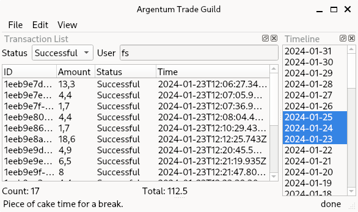

Argentum
===


A client for the SumUp API that allows retrieving more detailed statistics from the transaction data than the standard SumUp web interface.

Building
---

This project uses CMake.
Additionally, a full QT6 installation is required.

The following commands can be used to build the app:

```bash
mkdir build
cd build
cmake ..
make
```

Running
---

A SumUp API key is required to use this app, which may be generated using the [SumUp developer portal](https://developer.sumup.com/api-keys).
To access this portal a merchant or test account is required.
An appropriate key will have the prefix `sup_sk_`.
Upon retrieving the key, it can be registered in the app using the settings dialog.

